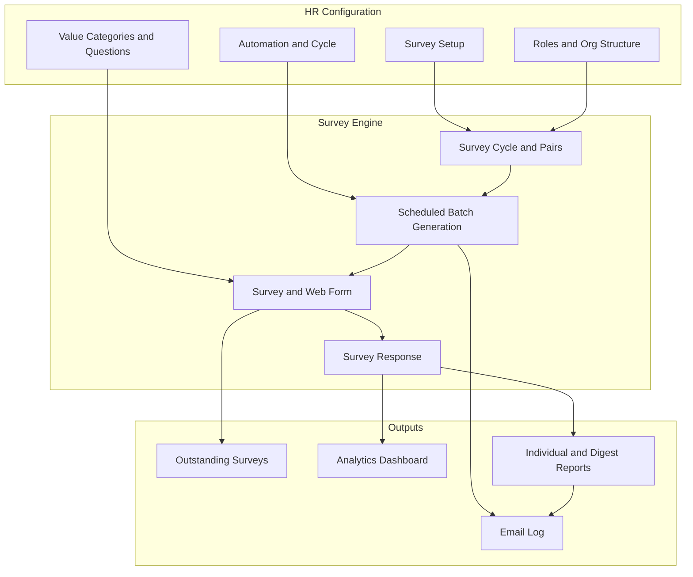

# Actserv Survey Engine — Management Overview

**Project:** Survey App (360° Employee Performance Surveys)
**Platform:** ERPNext / Frappe (integrated with company HR data)
**Prepared:** July 2026
**Status:** Implemented and deployable to production ERP

---

## 1. Executive Summary

The **Survey App** is a company-wide **360° feedback system** built inside our ERP. It lets HR plan who should review whom, send surveys on a schedule, collect structured competency ratings, follow up on incomplete responses, and deliver **individual and management reports** by email.

The system replaces ad-hoc or manual survey processes with a **repeatable cycle**: configure once, run automatically each period, and give leaders clear visibility into performance and completion.

**What management gets:**

- Planned, fair review coverage (team leaders, peers, cross-department “nearness” rules, MD reviews)
- Controlled workload per employee (surveys spread across the period, not dumped at once)
- Professional email reports for employees, team leaders, MD, and HR
- Dashboards and exports for HR and leadership
- Full audit trail of generation, emails, and report delivery

**Repository (reference):** [github.com/daynoh/survey-app](https://github.com/daynoh/survey-app)

---

## 2. Business Problem Addressed

| Challenge | How the Survey App addresses it |
|-----------|----------------------------------|
| Inconsistent 360° coverage | **Cycle Matrix** builds the required reviewer–reviewee pairs from org structure and rules |
| Survey fatigue (too many at once) | Required reviews are **split evenly** across survey sends in the reporting period, with configurable **min/max per batch** |
| Same questions every time (survey bias) | **~150 competency questions** across 5 categories; each survey randomly samples **5 per category** |
| No visibility on who has not responded | **Outstanding Surveys** page, grouped by cycle, with one-click reminders |
| Reports stuck in the ERP | **Automated HTML email reports** to employees and tailored digests for TL / MD / HR |
| HR cannot preview before go-live | **Preview** individual reports and all digest types from Survey Setup |
| No delivery accountability | **Survey Email Log** tracks invites, reminders, and reports (Queued / Sent / Failed) |

---

## 3. Solution Architecture (High Level)

All data lives in the **ERP database** (same Employee master, departments, and users). No separate survey platform to maintain.

---

## 4. Core Competency Framework

Surveys assess **five performance categories**, each with a large question bank:

| Category | Questions in bank | Shown per survey |
|----------|-------------------|------------------|
| Communication | ~31 | 5 (random) |
| Leadership | 30 | 5 (random) |
| Problem Solving | 30 | 5 (random) |
| Teamwork | 30 | 5 (random) |
| Technical Skills | 30 | 5 (random) |

**Rating scale:** 1 (Poor) → 5 (Excellent) on a matrix per category.

**Why randomization matters:** Reviewers see different question sets each cycle, reducing pattern memorization while keeping scoring comparable at category level.

---

## 5. Survey Cycle & Review Planning

### 5.1 Cycle Matrix (recommended mode)

For each **completeness cycle** (e.g. Quarterly), the system plans **all required review pairs**:

| Rule type | Example |
|-----------|---------|
| Team Leader | TL rates each team member |
| Peer | Colleagues in the same department rate each other |
| TL to MD | Team leaders rate the Managing Director |
| Nearness | Cross-department pairs based on departmental nearness factors |

HR configures:

- **Managing Director** and **Team Leaders** (manual or org-based resolution)
- **Excluded** staff (not rated / not rating others)
- **Departmental Nearness Factors** (how strongly departments should review each other)

### 5.2 Workload balancing (recent enhancement)

Surveys are **not sent all at once**. They are spread across the number of sends that fit in the reporting period.

**Example:** Monthly reporting period + weekly survey frequency ≈ **4–5 batches** per cycle.

| Setting | Purpose | Default |
|---------|---------|---------|
| **Min surveys per reviewer (per batch)** | Floor so reviewers get a meaningful batch each send | 3 |
| **Max surveys per reviewer (per batch)** | Cap to prevent overload in one send | 10 |

**Example outcomes (min 3, max 10):**

- 15 required reviews over 4 sends → ~4, 4, 4, 3
- 5 required reviews over 4 sends → 3, then 2 (not 1 per week)

HR can **Preview Cycle Load** before enabling automation to see per-person batch estimates and warnings.

### 5.3 Automation

- **Survey frequency:** How often a batch is issued (Weekly, Monthly, etc.)
- **Completeness cycle:** Window in which all planned pairs must be assigned/completed
- **Scheduler:** Runs every 5 minutes when enabled; supports test intervals (e.g. Every 10 Minutes)
- **Generation Trail:** Log of each run — surveys created, reviewers notified, timestamps

---

## 6. Employee & Manager Experience

### 6.1 Taking a survey

- Reviewers receive an **email invite** with a link to a **web survey form** (no ERP login required for the form)
- **To-do / notification** in ERP for internal users
- Matrix layout: competency questions as rows, rating labels as columns

### 6.2 Reminders

- **Outstanding Surveys** lists everyone who has not completed assigned surveys
- Grouped by **Survey Cycle** (filter, collapse/expand, select-all per cycle)
- **Remind** one person, selected people, or all — with clear **[REMINDER]** email branding and in-app notification

---

## 7. Reporting & Communications

### 7.1 Individual employee report (email)

Sent automatically when report scheduling is enabled and cycle completion threshold is met (or as Progress report below threshold).

Each report includes:

- How many colleagues reviewed the employee
- Overall score and **organisation percentile**
- Breakdown by competency category vs organisation average
- **Email-safe charts** (table-based bars — works in Outlook/Gmail)
- **Actserv branding:** company logo and motto (*Impacting lives positively*) in the report masthead; sign-off from **Human Resources**
- Professional consulting-style layout (executive summary, KPI strip, confidential footer)

Employees receive this **by email only** — they do not need Survey workspace access.

### 7.2 Management digests (separate formats)

| Audience | Report name | Content |
|----------|-------------|---------|
| **Team Leader** | Team Performance Digest | Team members ranked + individual breakdowns |
| **Managing Director** | Leadership Performance Digest | Managers ranked by individual score and team average |
| **HR** | Organisation Performance Digest | All teams ranked + full individual ranking |

HR can **preview every report type** from Survey Setup before sending.

### 7.3 Email delivery log

**Survey Email Log** records every outbound message:

- Survey Invite
- Survey Reminder
- Individual Report
- Team / MD / HR digests

Filterable by **Survey Cycle**, status (Queued / Sent / Failed), and linked to the underlying Email Queue.

---

## 8. HR Analytics & Exports

### 8.1 Survey Analytics dashboard

Executive-style **360° Performance Dashboard**:

- KPI summary (response rate, average score, participation)
- Insights: top performer, needs attention, strongest competency, development focus
- Charts: scores by department, competency breakdown, employee scorecard
- **Toggles:** view by competency, by department, scorecard (overall vs single skill)
- Scales for large headcount (Top/Bottom 15, horizontal bars)

### 8.2 Employee 360° Response report

Standard ERP report with:

- Filterable date range and export to **Excel / CSV**
- HR Manager export permissions
- Reliable table display and export flow

---

## 9. Administration Hub

**Survey Administration** workspace (Desk) — single entry point for HR:

| Area | Purpose |
|------|---------|
| **Survey Setup** | Categories, questions, scoring, roles, automation, previews, generation trail |
| **Outstanding Surveys** | Follow-up and reminders by cycle |
| **Survey Analytics** | Dashboards and insights |
| **Survey Cycles** | Cycle status, pairs, completion % |
| **Survey Email Log** | Delivery tracking |
| **Survey Report Log** | Report send history |
| **Generation Log** | Batch generation audit |
| **Value Scoring Settings** | Global configuration |
| **Categories / Questions** | Competency content maintenance |

**Access:** System Manager and HR Manager (configurable).

---

## 10. Production Deployment

A full **production install guide** is in `README.md`. Summary:

1. Install app on the **live ERP site** (not dev database)
2. Run migrate + build assets
3. Install Survey Administration workspace
4. Configure roles, automation, and email
5. Build/refresh cycle and smoke-test one batch

**Important:** Dev bench (`erp.localhost`) and production use **separate databases**. Production install writes DocTypes and configuration into the live site only.

---

## 11. Deliverables Summary (What Was Built)

### Platform & integration
- Frappe app integrated with ERPNext Employee, Department, User, Email Queue
- Public web survey page for reviewers
- Scheduler hooks for generation and reports

### Configuration & content
- Survey Setup (multi-tab): Categories & Questions, Scoring, Roles & Org, Automation & Cycle, Generation Trail
- Value Performance Categories + Value Questions (expanded bank with migration patch)
- Departmental Nearness Factors, exclusions, MD/TL configuration

### Cycle & generation
- Survey Cycle + Survey Cycle Pair DocTypes
- Cycle Matrix pair builder and batch assignment
- Legacy Capped mode (retained for backward compatibility)
- Configurable min/max surveys per batch
- Generation Log with detail lines

### Operations
- Outstanding Surveys (cycle-grouped, reminders)
- Survey Email Log with status refresh
- Automation countdown and Run Now / Check Status

### Reporting
- Individual performance email reports
- Team Leader, MD, and HR digests (distinct formats)
- Report previews in Survey Setup
- Survey Report Log

### Analytics
- Redesigned analytics dashboard with insights and toggles
- 360 Response report fixes (table, export, permissions)

### Documentation
- Production README
- This management overview
- Internal change log (`documentation.md` at monorepo root)

---

## 12. Benefits to the Organisation

1. **Consistency** — Every cycle follows the same rules; no one is accidentally skipped if they meet the matrix criteria.
2. **Fairness** — Workload is spread over time; questions vary per survey while categories stay comparable.
3. **Accountability** — HR sees who is outstanding, what was sent, and what failed — by cycle.
4. **Leadership visibility** — TL, MD, and HR each get a digest suited to their role.
5. **Employee clarity** — Self-contained email report with benchmarks; no ERP training required to read results.
6. **Scalability** — Analytics and charts adapt to growing employee counts.
7. **Governance** — Audit logs for generation, email, and reports support HR compliance and review.

---

## 13. Recommended Next Steps for Management

| Step | Action |
|------|--------|
| 1 | Approve competency categories and question bank for go-live |
| 2 | Confirm MD, Team Leaders, and excluded roles in Survey Setup |
| 3 | Set survey frequency + completeness cycle (e.g. Weekly surveys, Quarterly cycle) |
| 4 | Set min/max batch sizes (e.g. min 3, max 8–10) and run **Preview Cycle Load** |
| 5 | Pilot one department or one cycle before company-wide rollout |
| 6 | Confirm production email account and test invite + reminder + report |
| 7 | Train HR on Survey Administration workspace and Outstanding Surveys |

---

## 14. Appendix — Technical Reference (for IT / HR systems)

| Item | Detail |
|------|--------|
| App name | `survey_app` |
| Main modules | `survey_config.py`, `surveys.py`, `survey_cycle.py`, `individual_report.py`, `outstanding.py`, `survey_analytics.py`, `email_log.py` |
| Key pages | `/app/survey-setup`, `/app/outstanding-surveys`, `/app/survey-analytics` |
| Public survey | `/survey?id={survey_name}` |
| Scheduler | `*/5 * * * *` — auto generation + report jobs |
| GitLab (company) | `gitlab.actserv-africa.com/.../survey-app` |
| GitHub (mirror) | `github.com/daynoh/survey-app` |

---

*Document generated from implemented features and project change history. For operational install steps, see `README.md`.*
